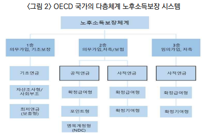

# 퇴직연금의 준공적연금화 필요성과 방안에 관한 연구

양재진(연세대학교 행정학과)

## I. 서론

- 한국은 초고령사회로 진입하고 있다
  - 2025년 한국의 65세 이상 고령인구가 총인구의 20%
  - 2060년이 되면 생산인구 1명이 노인 1명을 부양해야 함
- 일본을 보면 한국의 미래를 엿볼 수 있다
  - 일본의 경제성장의 정체로 인해 조세수입은 증가하지 못하는데, 사회지출의 대부분을 차지하는 연금과 의료 지출은 계속 늘고 있다.
  - 멈추지 않는 재정적자는 GDP 대비 250%가 넘는 국가채무로 이어지고 있다.
- 40년 후면 한국이 일본보다 더 심한 초고령 국가가 된다
  - 인구의 반을 차지하는 고령인구에 대한 적절한 소득보장 여부가 대한민국 국민의 삶의 질에 커다란 영향을 미치게 된다
  - 현재 국민연금과 기초연금의 재정구조는 세대 간 소득이전 방식을 취하고 있다.
    - 국민에게 약속된 국민연금 급여(소득대체율 40%)를 지급하기 위해서는 연금보험료율이 현행 9%에서 2060년에는 29.3%로 인상되어야 할 것이다.
- 인구고령화를 먼저 경험한 스웨덴, 독일 등 많은 국가에서는 노후소득보장의 총비용에 한계를 설정하고, 다층체계 하에서 비용부담을 다변화하는 노력을 기울이고 있다.
  - 큰 틀에서 공적연금의 급여 삭감 등을 통해 재정적 지속가능성을 확보하고, 부족할 수 있는 노후소득은 사적연금을 통해 보완하고 있다.
  - 스웨덴과 호주는 개인별 사적연금 가입이 의무화 되어 있다.
  - 독일은 정액 보조금 지급을 통해 저소득층을 포함해 개인연금의 가입을 유인하고 있다.
  - 스위스, 덴마크, 네덜란드 같은 나라는 기초연금만 국가가 운영하고, 직역연금과 직업연금이 다른 나라의 공적연금과 같은 역할을 한다.
- 한국은 사용자가 1년 이상 근속하는 근로자에게 퇴직금 혹은 퇴직연금을 지급해야 한다.
  - 그러나 퇴직연금은 연금으로서의 기능을 못하고 있다.
  - 대부분 은퇴 시 연금이 아닌 일시금으로 수령하고 있기 때문이다.
  - 한국의 퇴직연금제도는 다른 OECD 국가의 기업연금과 달리 연금이 아닌 사외적립형 퇴직금처럼 사용되고 있다.
- 본 연구는 초고령사회를 맞이하여 노후소득보장의 다층체계 안에서 퇴직연금의 준공적연금화(의무화+연금화)의 필요성을 논하고 실행 방안을 제시하고 있다.
  - 즉, 퇴직연금이 국민연금과 더불어 노후소득보장제도로 기능할 수 있는 방안을 찾는 것이다.
  - 퇴직연금의 '의무화'를 통해 퇴직연금의 사각지대를 없애고 모든 1년 이상 재직근로자가 퇴직금이 아닌 퇴직연금에 가입하게 만든다.
  - 퇴직연금의 '연금화'란 퇴직연금 수급을 일시금이 아닌 연금으로 받게 하여, 국민연금의 낮은 급여를 보완하게 한다.
  - 퇴직연금의 가입자가 크게 늘고 또 퇴직급여의 연금화로 퇴직연금이 고령 은퇴자의 노후소득원으로 작동하게 되면, 국민연금의 재정안정화 조치도 가능하게 된다.
  - 퇴직연금과 지속가능성이 높아진 국민연금을 통해 중간계층에게 적절한 노후소득이 보장되면, 국가의 가용자원은 국민연금의 적자를 메우는 데 소진하는 것이 아니라 저소득 노인의 기초소득보장에 더 크게 쓰일 수 있을 것이다.

## II. 한국 노후소득보장 환경 변화와 현행 다층체계의 문제점

### 1. 인구구조 변화, 잠재성장률 및 복지재정의 한계

#### 1) 인구구조의 변화

- 한국의 인구는 2020년 5,183만명을 정점으로 2021년부터 감소하기 시작해 2070년에는 3,153만명까지 줄어들 것으로 전망된다.
  - 15세 미만 유소년인구는 631만명에서 282만명으로 절반이 넘게 감소
  - 15세에서 64세 생산연령인구는 3,738만명에서 1,737만명으로 총인구 대비 72.1%에서 46.1%로 급감
  - 65세 이상 노령인구의 비율은 15.7%에서 46.4%로 30%p 이상 증가

#### 2) 잠재성장률 하락과 국가재정의 장기전망

- 2012년 이후 경제성장률은 연평균 3% 이하로 떨어졌다. 이후 계속 하락해 2019년에는 2% 대로 떨어졌다.
  - 성장률 하락 추세는 장기적으로 이어질 것으로 예상된다.
  - 한국개발연구원(KDI)은 2030년대 한국경제의 잠재성장률을 1%대, 2050년대는 1.1% 수준에 불과할 것으로 예상하고 있다.
- 보건복지부의 제4차 중장기 사회보장 재정추계에 따르면, 현재의 제도 변화가 없어도 인구고령화와 함께 연금, 의료, 노인요양 등 고령화 관련 복지지출이 크게 증가하여, 2020년 현재 GDP의 8.3%인 것이 2040년에는 15.6%, 2050년에는 20%, 2060년에는 23.2%로 크게 늘어난다.
- 국회예산정책처는 현행 복지제도와 조세제도가 그대로 유지되면, 고령화 관련 복지지출의 증가로 인해 국가채무가 2050년에 GDP대비 100%를 넘고, 2060년에는 160%에 달하게 될 것으로 전망한다.
- 우리의 급속한 인구고령화와 경제성장의 둔화 때문에 노령인구 부양에 대한 생산인구의 부담이 매우 클 것이라는 점은 변하지 않는다.

### 2. 노후소득보장의 다층체계와 한국의 문제점

#### 1) OECD국가의 다층체계 하 노후소득보장

- 1980년대 들어 세계은행(World Bank), 국제노동기구(ILO), OECD 등의 국제기구들은 연금의 3대 기능(생애주기 저축, 장수의 위험에 대한 보험, 기초보장)이 보다 효과적으로 발휘될 수 있도록 다층제로 만들어 연금제도 간 기능과 역할을 명확히 할 것을 권고하고 있다.
- 고령화 사회에서, 세대간 이전방식인 부과방식과 확정급여 방식에 기초한 전통적인 공적연금의 재정적 지속가능성을 확보하기 위해서 급여 인하와 수급연령 인상 등이 불가피하다.
  - 이로 인한 소득보장 기능의 약화는 사적연금의 의무화 혹은 활성화로 보완한다.
  - 그리고 기초보장은 보편주의적 기초연금에서 탈피해 보충급여방식의 최저보장연금이나 사회부조를 활용하여 고령자 빈공방지에 중점을 두는 것이다.
- 실제로 대부분의 OECD 국가들은 1980년대 공적연금의 재정안정화 개혁을 거쳤다.

## III. 퇴직연금의 준공적연금화 필요성과 해외 사례

## IV. 한국 퇴직연금의 준공적연금화 방안

## V. 결론
